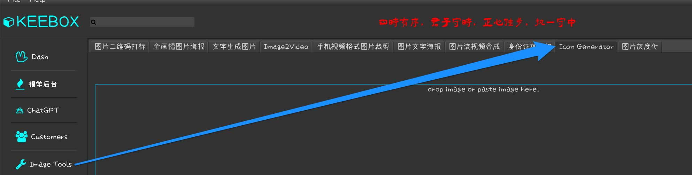

# Intro

This is Fuqiang's JavaFX project starter(aka. scaffolding project template)

# As to icon

For macos ICNS icon, resort to IconGenerator in KEEBOX image tool:

# As to distributions

Macos/Win/Linux are all supported but with different distribution formats.

- Macos: DMG
- Win: EXE
- Linux: fatjar (with optional startup script)
- other: fatjar

基于此项目的github actions构建多系统应用安装包之前，需要对scripts下打包脚本中相应信息和参数进行调整（根据项目具体情况，比如app name， 比如jar name）

另外， 项目目录下fixtures存放的只是默认仅供参考的icon图标文件，通常具体项目也要相应的更换。（splash.png一般不需要，因为splash screen通常在JavaFX程序内部完成，所以资源文件也是在JavaFX应用程序项目内部维护保存）

